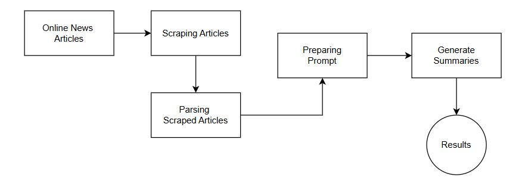
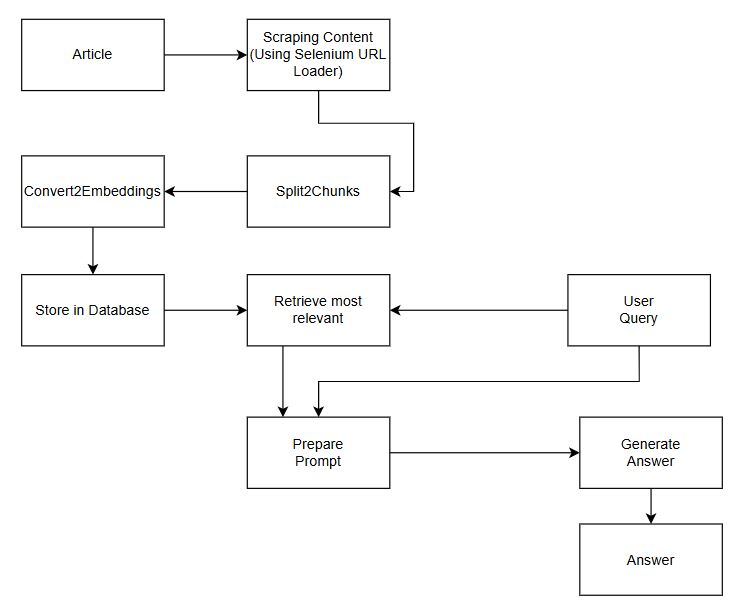
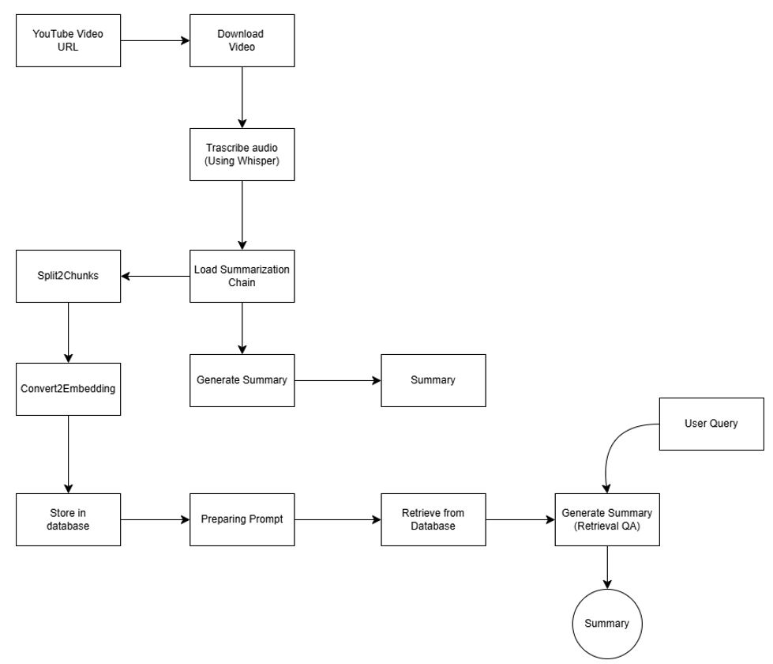

# LLM Tutorials and Learning Projects

This repository contains tutorials and learning projects to experiment with concepts in Large Language Models (LLMs). All projects are implemented in Jupyter Notebooks.

---

## Tutorials and Projects

### 1. **Introduction to LLMs**
Notebook: `introduction_to_llms.ipynb`

- **Objective**: Learn how to use the ChatGPT API through practice tasks.
- **Tasks**:
  - **Simple Translation**: A basic translation task.
  - **Controlling Outputs from Few-Shot Learning**: Experiment with guiding LLM outputs using few-shot examples.

---

### 2. **Basic RAG Pipeline**
Notebook: `basic_rag_pipeline.ipynb`

- **Objective**: Build a simple Retrieval-Augmented Generation (RAG) pipeline.
- **Steps**:
  - Downloaded an article and performed text chunking.
  - Converted text into embeddings using OpenAI.
  - Retrieved embeddings using cosine similarity stored in a DataFrame.
  - Performed inference using:
    - Google GenAI (`gemini-1.5-flash`)
    - OpenAI (`gpt-3.5-turbo`)

---

### 3. **LangChain Application**
Notebook: `langchain_application.ipynb`

- **Objective**: Explore simple LangChain applications.
- **Tasks**:
  - "Hello World" level inferencing using HumanMessage Prompt templating with OpenAI (`gpt-3.5-turbo`).
  - Summarization of a PDF document using `PyPDFLoader`.

---

### 4. **News Article Summarizer**
Notebook: `news_article_summarizer_langchain.ipynb`

- **Objective**: Summarize news articles using LangChain.
- **Steps**:
  - Scraped news articles.
  - Used HumanMessage prompt templating from LangChain.
  - Generated bullet-point summaries with proper prompts.


---

### 5. **Llama Index Overview**
Notebook: `llama_index_overview.ipynb`

- **Objective**: Understand and utilize LlamaIndex.
- **Steps**:
  - Used `download_loader` for `WikipediaReader`.
  - Loaded and analyzed data with NLP and AI tools.

---

### 6. **Customer Support QA Chatbot**
Notebook: `customer_support_qa_chatbot.ipynb`

- **Objective**: Build a chatbot for customer support.
- **Steps**:
  - Downloaded articles using `SeleniumURLLoader`.
  - Stored data in a vector storage database using FAISS.
  - Queried the vector datastore and formatted output with `PromptTemplate`.


---

### 7. **YouTube Video Summarizer**
Notebook: `youtube_video_summarizer.ipynb`

- **Objective**: Summarize YouTube videos using Whisper and LangChain.
- **Steps**:
  - Downloaded and transcribed YouTube videos using Whisper.
  - Summarized content using `SummarizationChain`.
  - Split content into chunks, converted to embeddings, and stored in a vector database.
  - Prepared prompts and queried the database.
  - Generated summaries using `RetrievalQA`.


---

## How to Use
1. Clone this repository:
   ```bash
   git clone <repository_url>
   cd <repository_name>
   ```
2. Open the notebooks with Jupyter:
   ```bash
   jupyter notebook
   ```

---
